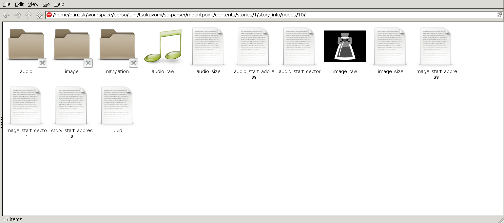
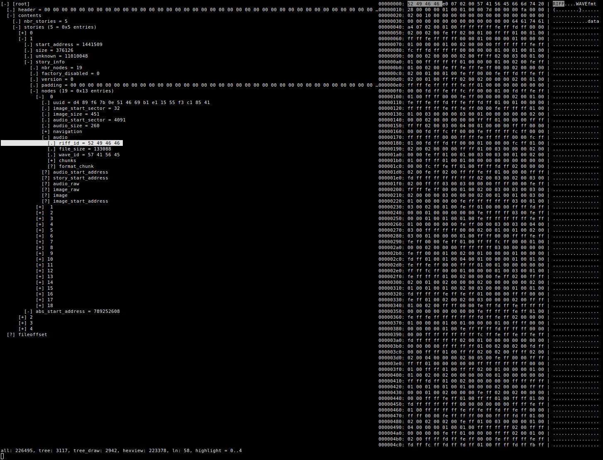

# Tsukuyomi

This is a placeholder for scripts and tools used for
[Lunii](https://www.lunii.fr/) reverse engineering project called **Tsukuyomi**.

The format of Lunii image content structure is still under **ongoing** reverse
engineering to produce a [lunii.ksy](sd-parser/kaitai-struct/lunii.ksy) file
which describe the format of Lunii image in [Kaitai Struct](https://kaitai.io/),
a DSL language that help on dealing with arbitrary binary formats.

For more information about the project please visit
[hackaday.io project page](https://hackaday.io/project/167629-tsukuyomi).

## ^^Disclaimer^^


**Tsukuyomi** scripts and tools **try** to not alter directly with the Lunii sdcard,
Thus it is highly recommended to create a disk dump of the Lunii sdcard and use
it as a middle and safe step before writing the final image to your Lunii sdcard.

Also make sure to always keep an original backup of the sdcard, to write it
back if anything goes wrong.

So please don't blame on me if you harm your kid's best toy Lunii :innocent: !!!
USE THIS AT YOUR OWN RISK!!!

## Install Tsukuyomi and dependencies
1. Clone this repo:
```
$ git clone https://github.com/danksz/tsukuyomi
```

1. Install Kaitai Struct Compiler from project repo:
```
$ sudo apt-key adv --keyserver hkp://pool.sks-keyservers.net --recv 379CE192D401AB61
$ echo "deb https://dl.bintray.com/kaitai-io/debian_unstable jessie main" | sudo tee /etc/apt/sources.list.d/kaitai.list
$ sudo apt-get update
$ sudo apt-get install kaitai-struct-compiler
```

1. Install Kaitai Struct Python Runtime library:
```
$ git clone https://github.com/kaitai-io/kaitai_struct_python_runtime
$ sudo python setup.py install
```

1. Compile the Kaitai Struct YAML Lunii description file
[lunii.ksy](sd-parser/kaitai-struct/lunii.ksy) to  python module using **ksc**
the Kaitai Struct Compiler.
```
$ cd tsukuyomi/sd-parser
$ kaitai-struct-compiler --target python kaitai-struct/lunii.ksy
```

1. Start using scripts `sd-lunii-*` scripts, create new ones and contribute ;-)

## Parse Lunii Image
Execute the `sd-lunii-parser.py` script to parse a Lunii image to find stories
and their belongings embedded media files (Bitmaps and WAV sounds).
```
cd tsukuyomi/sd-parser
$ ./sd-lunii-parser.py Lunii.img
```

## Mount Lunii Image
Thanks also to another Kaitai Struct project called
[KaitaiFS](https://github.com/kaitai-io/kaitai_fs/) we can mount a Lunii image
as filesytem and navigate within it like a normal driver by providing only the
KSY file.

```
$ git clone https://github.com/kaitai-io/kaitai_fs
$ cd kaitai_fs
$ sudo python setup.py install
$ cd ../tsukuyomi/sd-parser
$ mkdir mountpoint
$ python3 -m kaitaifs.generic lunii Lunii.img mountpoint
```



**(NOT TESTED YET)** I believe that we can directly mount the sdcard with:
```
$ sudo python3 -m kaitaifs.generic /dev/mmcblkX  mountpoint
```

## Extract Stories
Execute [sd-lunii-extract-stories.py](sd-parser/sd-lunii-extract-stories.py)
script to extract from a Lunii image all stories to the folder `out-extract`.
```
$ cd tsukuyomi/sd-parser
$ ./sd-lunii-extract-stories.py Lunii.img
```

## Add Stories
To add new stories to the Lunii image, we can use the
[sd-lunii-concat-stories.py](sd-parser/sd-lunii-concat-stories.py)
script which create a new Lunii image in `out` folder containing the base Lunii
image and  and the stories located in a input folder.
```
$ cd tsukuyomi/sd-parser
$ ./sd-lunii-concat-stories.py Lunii.img out-extract
```

## Lunii Image Content Visualizer
Thanks to
[Kaitai Struct Visualizer](https://github.com/kaitai-io/kaitai_struct_visualizer)
we can visualize the parsing of a Lunii image content:

```
$ sudo gem install kaitai-struct-visualizer
$ cd tsukuyomi/sd-parser/kaitai-struct
$ ksv Lunii.img lunii.ksy
```



Please notes that the parsing may takes a very long time and it will eat a
very large amount of RAM (in GB!!) depending on how many stories are put in
the Lunii image.
